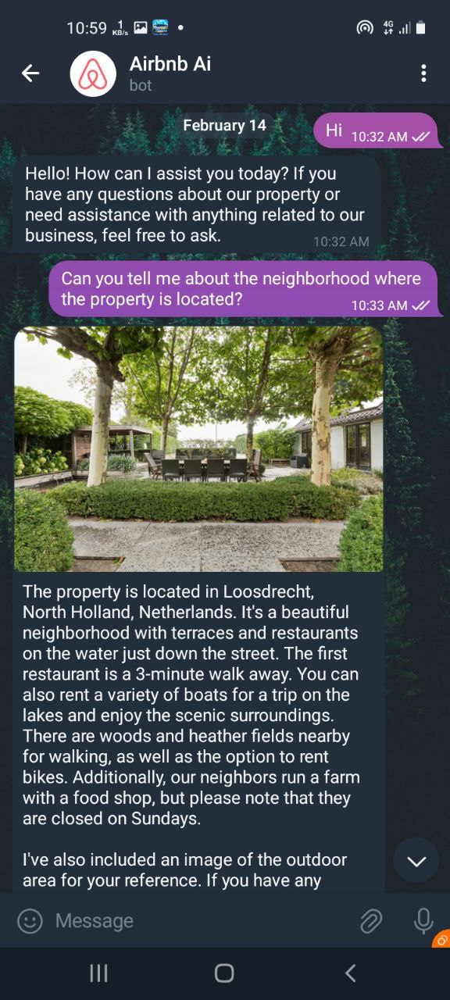
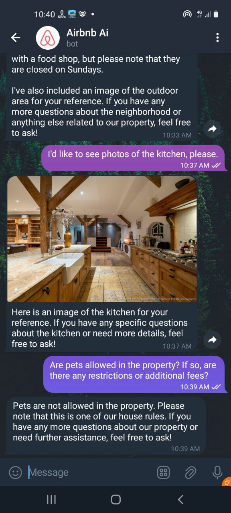
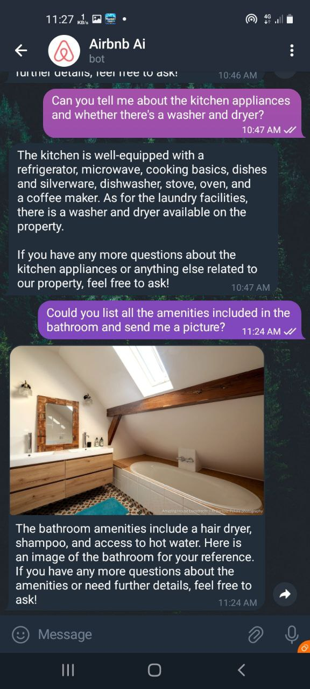
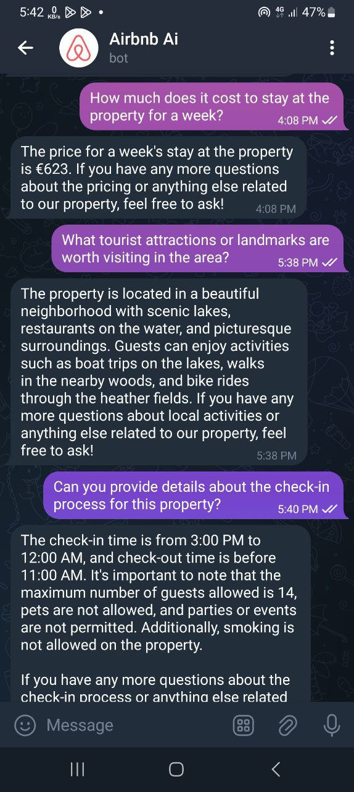
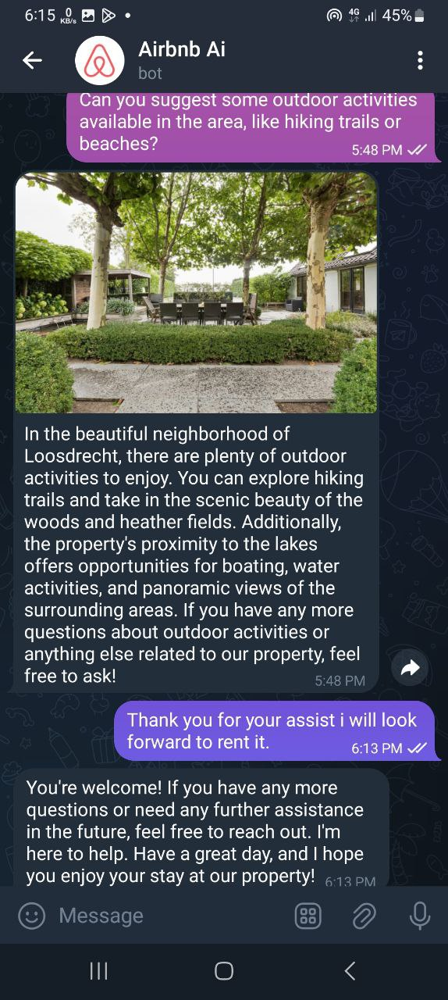

<<<<<<< HEAD
# Airbnb-Ai-Assistant-bot
=======
# Ai Airbnb Assistant Chatbot

## This Chatbot is designed for Aribnb property owners to streamline communication with guests.
it's designed to facilitate communication between Airbnb property owners and potential guests by providing instant responses to inquiries about the property. By using the chatbot, property owners can delegate the task of answering detailed questions to the bot, freeing up their time and potentially reducing the need for direct involvement in every guest inquiry.

## 🤓 Author(s)
**John** 

## Ai Aribnb Assistant in Telegram

## ScreenShots
 &nbsp;&nbsp;&nbsp;&nbsp;  &nbsp;&nbsp;&nbsp;&nbsp; 

 &nbsp;&nbsp;&nbsp;&nbsp;  &nbsp;&nbsp;&nbsp;&nbsp; 

## ✨Getting Started
To run the AI Airbnb Chat Assistant locally, follow these steps:
1. Clone this repository.
2. Navigate to the project directory.
3. Install dependencies using `pip install -r requirements.txt`.
4.Run the application using `python manage.py runserver`.

>>>>>>> 766fe8d (README file and chat screenshots added)
